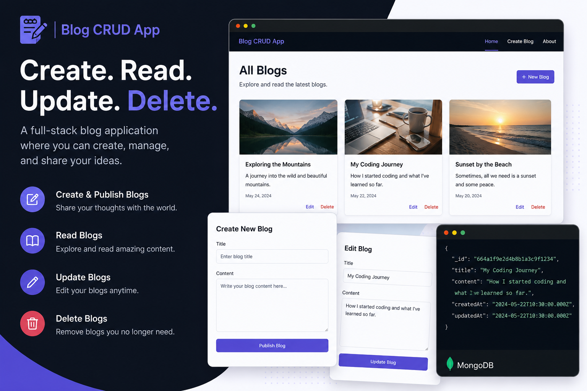

<p align="center">
  
</p>

<h1 align="center">📝 Blog CRUD Application</h1>

<p align="center">
A Full Stack Blog Management Platform Built While Learning Backend, APIs, and Database Integration 🚀
</p>


# 📝 Blog CRUD Application

## 🚀 About This Project

Hey! This is my Blog CRUD Application project that I built to strengthen my understanding of full-stack web development and database operations.

While building this project, I wanted to go beyond simply creating pages and actually understand how frontend, backend, APIs, and databases communicate with each other in a real application.

This project allows users to create, read, update, and delete blog posts while interacting with stored data dynamically.

---

## ✨ What I Built

✔ Create new blog posts

✔ View existing blog posts

✔ Edit blog content

✔ Delete blog posts

✔ Backend API integration

✔ Database connectivity

✔ Dynamic data rendering

✔ Route handling and server communication

---

## 🛠 Technologies I Used

### Frontend

* HTML
* CSS
* JavaScript

### Backend

* Node.js
* Express.js

### Database

* MongoDB

### Development Tools

* VS Code
* Git
* GitHub

### Testing tool
* Postman

---

## 📂 Project Structure

```bash
Blog-CRUD-App/
│
├── frontend/
│
├── backend/
│
├── routes/
│
├── models/
│
├── controllers/
│
├── database/
│
└── README.md
```

---

## 💡 Why I Built This

I created this project because I wanted practical experience with how real applications manage data.

Instead of only learning theory, I wanted to understand:

* How CRUD operations actually work
* How APIs communicate between frontend and backend
* How databases store and retrieve information
* How to structure a complete application

This project helped me connect all those concepts together.

---

## ⚙ Installation

Clone the repository

```bash
git clone <repository-url>
```

Move into project folder

```bash
cd Blog-CRUD-App
```

Install dependencies

```bash
npm install
```

Run application

```bash
npm start
```

---

## 📸 Project Screenshots

Add your screenshots here

* Homepage Screenshot

* Create Blog Page

* Update Blog Page

* Database Screenshot

---

## 🚧 Challenges I Faced

During development, I faced several challenges such as:

* Connecting backend with database
* Handling API requests properly
* Managing routes
* Debugging errors between frontend and backend

Working through these challenges improved my debugging and problem-solving skills significantly.

---

## 🔮 Future Improvements

Some features I would like to add in future:

* Authentication System

* User Accounts

* Comments Section

* Search Functionality

* Dashboard Analytics

* Better UI/UX

---

## 🎯 Final Thoughts

This project gave me hands-on experience with full-stack development and helped me understand how complete applications are built.

It may look like a simple blog application, but building it taught me much more about architecture, debugging, APIs, and database management.

Thanks for checking out my project 😊

⭐ Feel free to explore, fork, or contribute.
